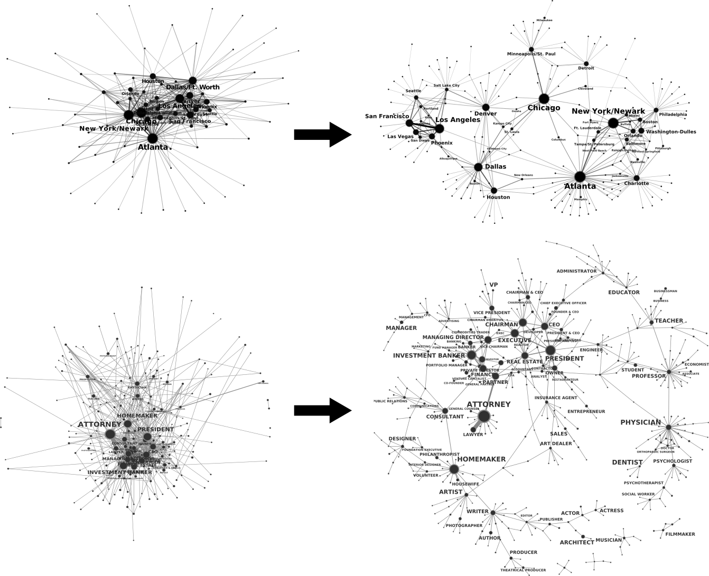

# GraphPruning
Package for "pruning" weighted complex networks based on the Marginal Likelihood Filter.

# Overview
When dealing with weighted complex networks of dyadic relationships between nodes, we frequently encounter overly-dense "hairball" networks where the large number of edges may obfuscate the most important structures within the graph. 

People often "prune" the graph by simply setting a threshold on the edge weights and removing all edges below the threshold. However, this simplistic approach systematically disfavours low-degree nodes and the structures they represent.Therefore, we need to measure the significance of an edge, with respect to the degrees of its incident vertices. 

Here, we do this using a version of the configuration model as our null model that defines what we expect an edge’s weight to be given its end-nodes’ degrees. The null model predicts a probability distribution for the value of the edge weight. By comparing the observed weight of an edge with this predicted distribution, we can then compute a p-value which tells us how surprising the observed value is given the null model. This p-value gives us a measure of the statistical significance of the edge, and we can filter the edges according to this significance rather than the raw weight itself.

These are examples of graphs pruned using the MLF. For details of the data and results, see the paper below.



# How to use the package
```python
import igraph as ig
from pruning import unimodal
import numpy as np
```

```python
# Create a graph with random integer weights
g = ig.Graph.Barabasi(1000,3)
g.es['weight'] = np.random.randint(1,40, g.ecount())

# Get the edgelist dataframe with columns
# ['source', 'target', 'weight']
df = g.get_edge_dataframe()

# Instantiate an MFL object and compute
# the edge significance 
mlf = unimodal.MLF(directed=False)
G = mlf.fit_transform(g)
df_edgelist_1 = G.get_edge_dataframe()

# New edge attribute "significance" is created
# ['weight', 'significance']
print(G.es.attributes())

# Apply the transformer to the edgelist
# dataframe of the graph
mlf = unimodal.MLF(directed=False)
df_edgelist_2 = mlf.fit_transform(df)


# df_edgelist_1 and df_edgelist_2 are "equivalent"
```
- Link to paper: http://journals.aps.org/pre/abstract/10.1103/PhysRevE.93.012304 (preprint: http://arxiv.org/abs/1503.04085)

